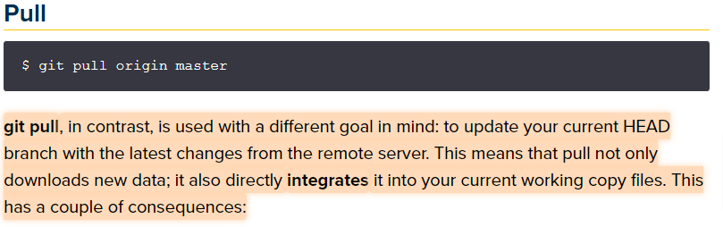

## layout: post

## HBPaper clone coding 시작

- git pull 개념 이해하기



- gsock timeline 기능 사용

```javascript
const visual01TL = gsap.timeline();
visual01TL
  .from("#main-visual .visual01 .sub .char", {
    x: 100,
    opacity: 0,
    stagger: {
      each: 0.02,
    },
  })
  .from(
    "#main-visual .visual01 .main .char",
    {
      x: 100,
      opacity: 0,
      stagger: {
        each: 0.1,
      },
    },
    "-=1"
  );
// .sub animation이 끝나기 0.5s 전에 시작하고 싶을 때는 "-= 0.5 "or ">-0.5"
// .sub animation이 끝나고 1초 후에 시작하고 싶을 때는 ">1"
// .sub animation 시작 0.5s 후 시작하고 싶을 때는 0.5
```
